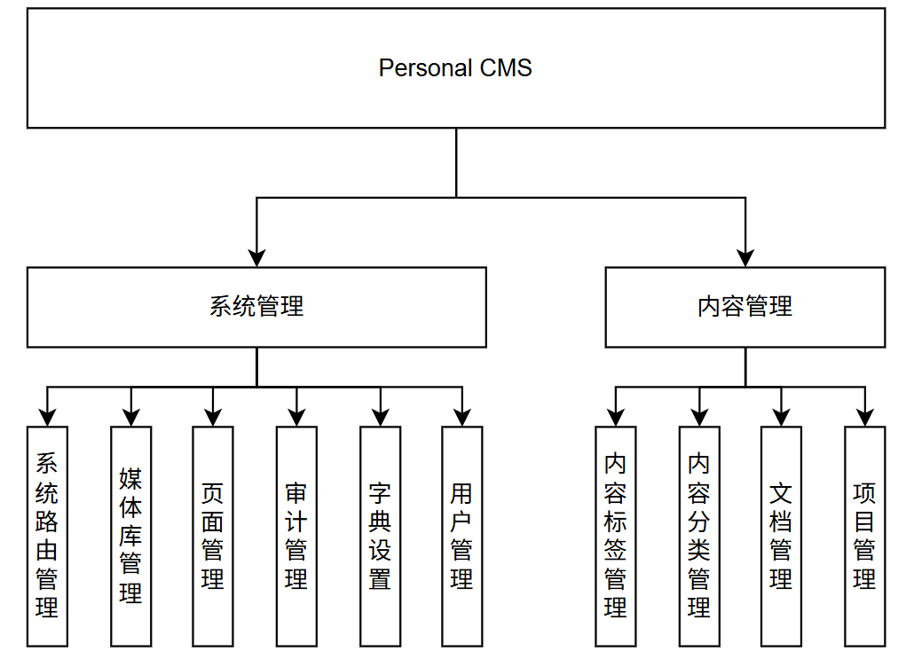

# 系统设计文档

## 1. 系统功能模块

系统功能模块架构图如下图所示：

 

- [系统路由管理模块](#21-系统路由管理模块) 

## 2. 功能设计

### 2.1 系统路由管理模块

1. 功能说明

- 创建系统路由
- 更新系统路由
- 删除系统路由
- 构建系统路由树
- 构建导航树
- 查询路由详情

1. 输入

- 创建系统路由 & 更新系统路由

  | 字段       | 类型       | 默认   | 备注                                    |
  | :---: | :---: | :---: | :---: |
  | name      | string   | -    | 路由名称                                  |
  | path      | string?  | -    | 访问路径                                  |
  | icon      | string?  | -    | 路由图标                                  |
  | isActive  | boolean  | true | 是否启用该路由                               |
  | parentId  | string?  | -    | 父级ID                                  |
  | isFold    | boolean? | true | 目录是否折叠                                |
  | routeType | string   | page | 路由类型（set,group,directory,page,button） |
  | sortOrder | number   | 0    | 路由排序                                  |

  - `RouteType[group]` **不允许**设置 `path`，`RouteType[directory]` **允许**不设置 `path` 。
  - 所有子级 `path` **必须**包含父级前缀。
    > 假设 `RouteType[set]:path = /set` , `RouteType[directory]:path = /example/<dir>` ，那么 `RouteType[page]:path` 必须为 `/set/<dir>/page` 的形式。任何形如 `/x` 、 `/set/m/n`（`RouteType[directory]` 无 `path`）和 `/set/dir/m/n`（`RouteType[directory]` 有 `path`） 的格式均视为非法。
  - 修改 `path` 时需要修改页面管理对应的路由以及子级对应段 `path`
- 删除路由

  | 字段   | 类型     | 默认  | 备注   |
  | :---: | :---: | :---: | :---: |
  | id   | string | -   | 路由id |
  | path | string | -   | 访问路径 |

  - 删除记录时将 `path` 清空，创建对应的审计记录（审计记录待设计）

- 构建系统路由树

  > 无输入，查询在客户端直接进行

- 构建导航树

  > 无输入，直接构建对应 `set` 下启用的路由

- 查询路由详情

  | 字段        | 类型       | 默认   | 备注                             |
  | :---: | :---: | :---: | :---: |
  | id      | string   | -    | 路由id                                  |

2. 控制条件

描述本功能的事先或事后控制条件，如果业务流程中没有特殊控制条件，此项可省略。

3. 处理流程

［编写说明］

详细说明本模块的主干和各分支业务流程的处理过程。

4. 输出

- 创建系统路由 & 更新系统路由 & 删除路由
  > 无输出

- 构建系统路由树

  | 字段        | 类型       | 备注                             |
  | :---: | :---: | :---: |
  | id      | string   | 路由id                                  |
  | name | string | - |
  | path | string | - |
  | icon      | string | 路由图标                                  |
  | isActive  | boolean  | 是否启用该路由                               |
  | routeType | string   | 路由类型（set,group,directory,page,button） |
  | sortOrder | number   | 路由排序                                  |
  | parentId | string | 父级ID |
  | parentLabel | sting | 父级名称 |
  | children | object   | 子节点                                  |

- 构建导航树

  | 字段  | 类型  | 备注   |
  | :---: | :---: | :---: |
  | id      | string   | 路由id |
  | name | string | - |
  | path | string | - |
  | icon | string | 路由图标 |
  | sortOrder | number | 路由排序 |
  | children | object | 子节点 |

功能详细设计详见 [系统路由管理模块功能设计](./function/system-router.md)